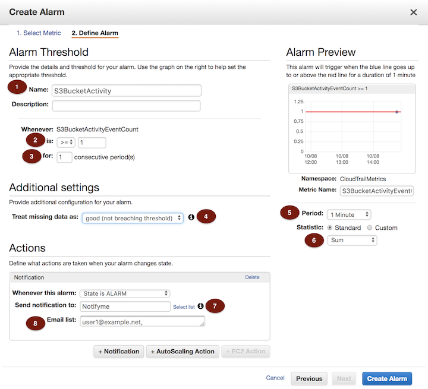
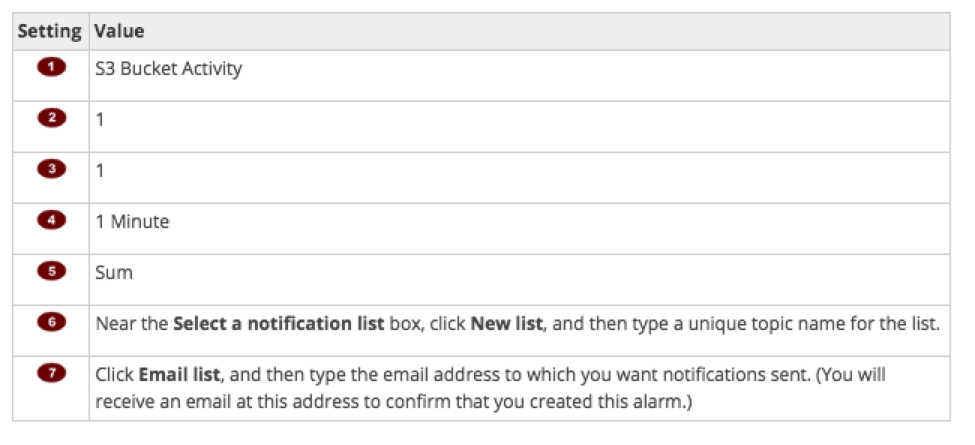
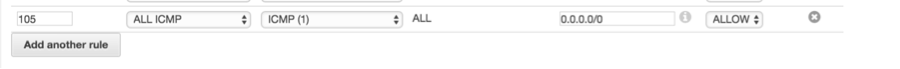
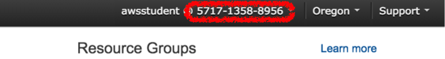

## re:Invent 2017 - SID402

# Module 1 - Monitoring Security Events in AWS

### Overview

You have taken a lead security engineering role in helping IthaCorp improve the security posture in their AWS environment. As you work through the Security Enhancement Project, you implement a series of detective controls to improve visibility into various AWS activities.

In this module, your task is to set up automatic notifications for a number of security related events in AWS. The module walks you through how to use the AWS Management Console and AWS CloudFormation to create Amazon CloudWatch alarms that is triggered when an AWS API call is made that may be of interest for security professionals.

The module walks you through the process of creating alerts for one such event using AWS Console. Steps for the rest of the events have been automated in a CloudFormation template, which is provided to you.
The module makes use of a number of AWS services namely AWS Identity and Access Management (IAM), AWS CloudTrail, AWS CloudWatch Alarms,  AWS CloudFormation and others.

### Topics Covered

After completing this module, you should be able to automate notifications for any of the below use cases:
- Amazon S3 Bucket Activity
- Security Group Configuration Changes
- Network Access Control List (ACL) Changes
- Network Gateway Changes
- Amazon Virtual Private Cloud (VPC) Changes
- Amazon EC2 Instance Changes
- CloudTrail Changes
- Console Sign-In Failures
- Authorization Failures
- IAM Policy Changes

### Prerequisites

This module is targeted for IT security focused individuals who are interested in learning about automating security related events on AWS. You will need an AWS account with administrators access.

To successfully complete this module, you should be familiar with AWS services including Amazon EC2, S3, VPC etc. and have a basic understanding of security groups, Network Access Control List (NACL), IAM Policies etc. You should be comfortable logging into and using the AWS Management Console and have familiarity with AWS Identity and Access Management (IAM).

### 1. Select a Region and Launch CloudFormation Stack

**Tip** The AWS region name is always listed in the upper-right corner of the AWS Management Console, in the navigation bar.

Make a note of the AWS *region name*, for example, *US West (Oregon),*

For more information about regions, see: [AWS Regions and Endpoints](http://docs.aws.amazon.com/general/latest/gr/rande.html)

**Note** If needed, create a new key pair: [Creating a Key Pair Using Amazon EC2](http://docs.aws.amazon.com/AWSEC2/latest/UserGuide/ec2-key-pairs.html#having-ec2-create-your-key-pair)

##### Launch the CloudFormation Stack in the preferred region:

___Hold the "Control" key while clicking and open the launch link in a new tab___

Region| Launch
------|-----
N. Virginia (us-east-1) | [](https://console.aws.amazon.com/cloudformation/home?region=us-east-1#/stacks/new?stackName=SID402-AutomatingSecurityEvents&templateURL=https://s3-us-west-2.amazonaws.com/sid402-artifacts/templates/AutomatingSecurityEvents.json)
Ohio (us-east-2) | [](https://console.aws.amazon.com/cloudformation/home?region=us-east-2#/stacks/new?stackName=SID402-AutomatingSecurityEvents&templateURL=https://s3-us-west-2.amazonaws.com/sid402-artifacts/templates/AutomatingSecurityEvents.json)
Oregon (us-west-2) | [](https://console.aws.amazon.com/cloudformation/home?region=us-west-2#/stacks/new?stackName=SID402-AutomatingSecurityEvents&templateURL=https://s3-us-west-2.amazonaws.com/sid402-artifacts/templates/AutomatingSecurityEvents.json)
Singapore (ap-southeast-1) | [](https://console.aws.amazon.com/cloudformation/home?region=ap-southeast-1#/stacks/new?stackName=SID402-AutomatingSecurityEvents&templateURL=https://s3-us-west-2.amazonaws.com/sid402-artifacts/templates/AutomatingSecurityEvents.json)
Sydney (ap-southeast-2) | [](https://console.aws.amazon.com/cloudformation/home?region=ap-southeast-2#/stacks/new?stackName=SID402-AutomatingSecurityEvents&templateURL=https://s3-us-west-2.amazonaws.com/sid402-artifacts/templates/AutomatingSecurityEvents.json)
Tokyo (ap-northeast-1) | [](https://console.aws.amazon.com/cloudformation/home?region=ap-northeast-1#/stacks/new?stackName=SID402-AutomatingSecurityEvents&templateURL=https://s3-us-west-2.amazonaws.com/sid402-artifacts/templates/AutomatingSecurityEvents.json)
Seoul (ap-northeast-2) | [](https://console.aws.amazon.com/cloudformation/home?region=ap-northeast-2#/stacks/new?stackName=SID402-AutomatingSecurityEvents&templateURL=https://s3-us-west-2.amazonaws.com/sid402-artifacts/templates/AutomatingSecurityEvents.json)
Ireland (eu-west-1) | [](https://console.aws.amazon.com/cloudformation/home?region=eu-west-1#/stacks/new?stackName=SID402-AutomatingSecurityEvents&templateURL=https://s3-us-west-2.amazonaws.com/sid402-artifacts/templates/AutomatingSecurityEvents.json)
London (eu-west-2) | [](https://console.aws.amazon.com/cloudformation/home?region=eu-west-2#/stacks/new?stackName=SID402-AutomatingSecurityEvents&templateURL=https://s3-us-west-2.amazonaws.com/sid402-artifacts/templates/AutomatingSecurityEvents.json)

1. On the Select Template screen, click **Next**.
2. On the Specify Details page, provide the key pair that you plan to use and your public IP range from which you will initiate SSH connections.
3. Click Next.
4. On the Options page, you can create tags or configure other advanced options. These are not required for this module.
5. Click **Next**.
6. On the Review page, verify that the template, key pair, SSH CIDR range, and other options, if any, are correct.
7. Select **I acknowledge that AWS CloudFormation might create IAM resources.** and click **Create**. The stack will be created in a few minutes.
8. If not already selected, select your stack by clicking on the check box to the left of your stack.
9. Click on the Events tab and refresh periodically to monitor the creation of your stack.</p>

### 2. Complete Initial Environment Configuration

In this section, you will perform configuration in the console for CloudTrail logging, CloudWatch Logs and a CloudWatch Alarm.

___Complete all the steps below unless they are marked "optional". Use arrow to expand sections marked with "(expand for details)".___

<details>
<summary><strong>1. Create a CloudTrail with the Console (expand for details)
</strong></summary><p>
<br/>

1. In the AWS Management Console, Under Management Tools, Select **CloudTrail**

.

2. Click on **Trails** from the pane in left and click **Create trail** button.


3. In the **Trail name** box, type a name for your trail such as "myCloudTrail"
.

4. For **Apply trail to all regions?**, choose **Yes** to receive log files from all regions.


5. For **Read/Write events**, choose **All**.

6. For **Data Events**, do not select any buckets.

7. For **Create a new S3 bucket?**, choose **Yes** to create a new bucket.


8. In the **S3 bucket** field, type a name for the bucket you want to designate for log file storage such as **"myxxxxcloudtrailbucket"** substituting something unique for **xxxx**.

9. Click **Create**.
The new trail will appear on the **Trails** page, which shows your trails from all regions.

Next, enable a role that CloudTrail can assume and deliver events to the log streams.
</details>

<details>
<summary><strong>2. Enable a Role (expand for details)
</strong></summary><p>
<br/>

<b>Add a policy to a role using the IAM console:</b>

1. In the AWS Management Console, under **Security, Identity & Compliance** select **IAM**.

2.	Click on **Roles** from the pane in left.

3. Click on the role name that begins with name of your CloudFormation stack (SID402-AutomatingSecurityEvents) and containing the string “LogsRole” (It should be the only one there).  This basic role has been created for you by the CloudFormation. We'll configure this role with permissions to deliver logs to the log group that we are going to create. With the **Permissions** tab open, click **Attach Policy**.

4. On the **Attach Policy** page, search with the Filter box for **CloudWatchLogsFullAccess**, select its check box, and click **Attach Policy**. Repeat this step to select and attach the policy **AWSCloudTrailReadOnlyAccess** as well.
</details>

<details>
<summary><strong>3. Create a Log Group (expand for details)
</strong></summary><p>
<br/>

CloudTrail uses a CloudWatch Logs log group as a delivery endpoint for log events. We will create a new log group.

<b>To specify a log group using the console:</b>

1. In the AWS Management Console, Under Management Tools, Select **CloudTrail**.

2.	Click on **Trails** from the pane in left. Choose the name of the trail that you have created "myCloudTrail". We'll configure this trail to deliver logs to the log group that we are going to create.

3.	Expand **CloudWatch Logs** section and click **Configure**.

4.	In the **New or existing log group** box, keep the DefaultLogGroup or type a log group name (For example myTestLogGroup) to organize CloudTrail events for you to review using CloudWatch Logs, and then choose **Continue**.


5. Expand **View Details** and look at the **Role Name** box. Expand **View Policy Document**. The default role policy contains the permissions required for creating a CloudWatch Logs log stream in a log group that you specify and for delivering CloudTrail events to that log stream.

6.	Choose **Allow**. When you are finished with these steps in the console, the CloudTrail trail will be set up to use the log group and role you specified to send events to CloudWatch Logs. If the trail you configured to use CloudWatch Logs receives log files across regions, events from all regions will be sent to the CloudWatch Logs log group that you specified.
</details>

<details>
<summary><strong>4. Create a Metric Filter (expand for details)
</strong></summary><p>
<br/>

1. In the AWS Management Console, Under Management Tools, Select **CloudWatch**

2.	In the navigation pane on left, click **Logs**.

3.	In the list of log groups, select the radio button next to the log group that you created for CloudTrail log events.

4.	Click **Create Metric Filter**.

5.	On the **Define Logs Metric Filter** screen, type the following in text box **Filter Pattern**:

<code>{ ($.eventSource = s3.amazonaws.com) && (($.eventName = PutBucketAcl) || ($.eventName = PutBucketPolicy) || ($.eventName = PutBucketCors) || ($.eventName = PutBucketLifecycle) || ($.eventName = PutBucketReplication) || ($.eventName = DeleteBucketPolicy) || ($.eventName = DeleteBucketCors) || ($.eventName = DeleteBucketLifecycle) || ($.eventName = DeleteBucketReplication)) }</code><p/>

**Note:** Review this filter pattern and take a note of this. Notice that a number of S3 bucket specific events are captured. Revisit this filter pattern when you are ready to test Amazon S3 bucket activity in steps provided below in this module. Steps are provided for testing one such events but you may want to test additional filters.

6. Click **Assign Metric**, and then on the Create Metric Filter and Assign a Metric screen, in the Filter Name box, delete existing text and enter **S3BucketActivity**

7.	Under Metric Details, in the **Metric Namespace** box, delete existing text and enter **CloudTrailMetrics**.

8.	In the **Metric Name** field, enter **S3BucketActivityEventCount**.

9.	Click **Metric Value**, and then type **1**. If Metric Value does not appear, click **Show advanced metric settings** first.

10. Click **Create Filter**.
</details>

<details>
<summary><strong>5. Create an Alarm (expand for details)
</strong></summary><p>
<br/>
<b>These steps are a continuation of the previous steps for creating a metric filter.</b>

1. You will notice a summary of the filter that has been created with message similar to **Your filter S3BucketActivity has been created**. On the **Filters for Log_Group_Name** page, next to the **S3BucketActivity** filter name, click **Create Alarm**.

2. On the **Create Alarm** page, provide the following values
  Name: **S3 Bucket Activity**
  Whenever S3BucketActivityEventCount is **>=** 1 for **1** consecutive period(s).

3. For the **Period** value, select **1 Minute**.

4. In the **Treat missing data as:** box, Click **good (not breaching threshold)**.

5. In the **Actions** box, Click **Select list**, **New list** for **Send notification to:**, provide a topic name such as **NotifyMe** and provide your email address. Refer to diagrams below.

<p/>



<p/>



<p/>

6. When you are done, click **Create Alarm**.

7. You will receive an email from **AWS Notification** at the email address provided in the **Email list**. Click on **Confirm subscription** link provided in the email.

8. Click on **View Alarm**.
</details>

### 3. Create Security Alarms Using AWS CloudFormation

In the previous steps you have learnt how to create a metric filter in CloudWatch and how to create an alarm for the metric via the AWS console. Creation of metric filters and corresponding alarms for the remaining security events described in the overview section has been automated for you using AWS CloudFormation template. Follow the steps below:

##### Launch the CloudFormation Stack in the previously selected region:

___Hold the "Control" key while clicking and open the launch link in a new tab___

Region| Launch
------|-----
N. Virginia (us-east-1) | [](https://console.aws.amazon.com/cloudformation/home?region=us-east-1#/stacks/new?stackName=SID402-CWLforCloudTrailAPIActivity&templateURL=https://s3-us-west-2.amazonaws.com/sid402-artifacts/templates/CloudWatch_Alarms_for_CloudTrail_API_Activity.json)
Ohio (us-east-2) | [](https://console.aws.amazon.com/cloudformation/home?region=us-east-2#/stacks/new?stackName=SID402-CWLforCloudTrailAPIActivity&templateURL=https://s3-us-west-2.amazonaws.com/sid402-artifacts/templates/CloudWatch_Alarms_for_CloudTrail_API_Activity.json)
Oregon (us-west-2) | [](https://console.aws.amazon.com/cloudformation/home?region=us-west-2#/stacks/new?stackName=SID402-CWLforCloudTrailAPIActivity&templateURL=https://s3-us-west-2.amazonaws.com/sid402-artifacts/templates/CloudWatch_Alarms_for_CloudTrail_API_Activity.json)
Singapore (ap-southeast-1) | [](https://console.aws.amazon.com/cloudformation/home?region=ap-southeast-1#/stacks/new?stackName=SID402-CWLforCloudTrailAPIActivity&templateURL=https://s3-us-west-2.amazonaws.com/sid402-artifacts/templates/CloudWatch_Alarms_for_CloudTrail_API_Activity.json)
Sydney (ap-southeast-2) | [](https://console.aws.amazon.com/cloudformation/home?region=ap-southeast-2#/stacks/new?stackName=SID402-CWLforCloudTrailAPIActivity&templateURL=https://s3-us-west-2.amazonaws.com/sid402-artifacts/templates/CloudWatch_Alarms_for_CloudTrail_API_Activity.json)
Tokyo (ap-northeast-1) | [](https://console.aws.amazon.com/cloudformation/home?region=ap-northeast-1#/stacks/new?stackName=SID402-CWLforCloudTrailAPIActivity&templateURL=https://s3-us-west-2.amazonaws.com/sid402-artifacts/templates/CloudWatch_Alarms_for_CloudTrail_API_Activity.json)
Seoul (ap-northeast-2) | [](https://console.aws.amazon.com/cloudformation/home?region=ap-northeast-2#/stacks/new?stackName=SID402-CWLforCloudTrailAPIActivity&templateURL=https://s3-us-west-2.amazonaws.com/sid402-artifacts/templates/CloudWatch_Alarms_for_CloudTrail_API_Activity.json)
Ireland (eu-west-1) | [](https://console.aws.amazon.com/cloudformation/home?region=eu-west-1#/stacks/new?stackName=SID402-CWLforCloudTrailAPIActivity&templateURL=https://s3-us-west-2.amazonaws.com/sid402-artifacts/templates/CloudWatch_Alarms_for_CloudTrail_API_Activity.json)
London (eu-west-2) | [](https://console.aws.amazon.com/cloudformation/home?region=eu-west-2#/stacks/new?stackName=SID402-CWLforCloudTrailAPIActivity&templateURL=https://s3-us-west-2.amazonaws.com/sid402-artifacts/templates/CloudWatch_Alarms_for_CloudTrail_API_Activity.json)

**Note:** Review the contents of the template to understand the metric filter and alarm creation via CloudFormation.

1. On the Select Template screen, click **Next**.

2. On the **Specify Details** page, provide the email address where you want to receive notifications, and the enter name of the log group name that you used when you configured CloudTrail log file delivery to CloudWatch Logs.

3. Click **Next**.

4. On the **Options** page, you can create tags or configure other advanced options. These are not required for this module.

5. Click **Next**.

6. Click **Create**. The stack will be created in a few minutes.

7. If not already selected, select your stack by clicking on the check box to the left of your stack.

8. Click on the **Events** tab and refresh periodically to monitor the creation of your stack.

9. CloudFormation template also creates a SNS topic for you to get update on other email address provided by you in previous steps. You will receive an email from **AWS Notification**, Click on **Confirm subscription** link provided in the email.

When AWS CloudFormation is finished creating the stack, the status will show CREATE_COMPLETE. This CloudFormation stack has created a number of security metric filters and related alarms for you. We'll test these events in the subsequent steps.</p>

### 4. And that's it. We are all set and now the fun part!! Let's generate some events and see what happens

We'll create a number of security events in this section of the module. The resources such as a VPC, Subnets, Security Groups, EC2 Instance, IAM Policy etc. The module covers a number of different events. We are providing a CloudFormation script that creates some resources like networking components (VPC, Subnet, NACL,Security Group etc.), S3 bucket, IAM entities, EC2 instance etc.
Manual Steps for a limited number of events are also provided in this section. Feel free to test remaining security events in the time left for the module.
**Note:** - It may take up to 15 minutes to receive the alarm in the CloudWatch console and email. You are advised to continue going through the steps below while waiting for an alarm to appear.

#### 1. Test Amazon S3 bucket Activity
1. In the AWS Management Console, under **Storage**, select **S3**.

2. Select the bucket **securityautomationtestbucketxxxx** and click on **Permissions** tab.

3. Under **Public access**, click the radio button **Everyone** and in the pop up box, select few permissions like **List Objects** or **Read bucket permission**. Do **not** allow **Write** permissions for **Everyone**.

4. Click **Save**

5. You will receive an Alarm **S3 bucket Activity** via email.
**Note:** - If you have not received email notification, navigate to AWS Console, Services, CloudWatch and click on **Alarms**. If this shows **Config Status** as **Pending confirmation**  then that means you have not yet confirmed SNS subscription yet. Refer to your email and subscribe to notifications from this module.

6. You can also view the status of Alarm via AWS CloudWatch console.

#### 2. Test Security Group Configuration changes

1. In the AWS Management Console, on the **Services** menu, click **EC2**.

2. Click on **Security Groups** under **NETWORK & SECURITY** section from the left pane.

3. Select **SID402-AutomatingSecurityEvents-InstanceSecurityGroup** from the list and click on **Inbound** tab on the bottom pane.

4. click **Edit**.

5. Click **Add Rule**. A new row is created.

6. Select **Type** of rule from the list, specify a port range (for example 8080 or 49152-50000) and a CIDR range for new inbound rule. Set Source to 0.0.0.0/0 if you are not sure.

7. Click **save**

8. You will receive an Alarm **CloudTrailSecurityGroupChanges** via email.

9. You can also view the status of Alarm via AWS CloudWatch console.

#### 3. Test EC2 Instance Changes

1. In the AWS Management Console, on the **Services** menu, click **EC2**.

2. Select SecurityTest EC2 instance by clicking on **Instances** In the navigation pane and click on **Actions** button at the top

3. Click on **Instance State** and then **Stop**. A Pop-up window for confirmation appears, click **Yes, Stop**.

4. You will receive an Alarm **CloudTrailEC2InstanceChanges** via email.

5. You can also view the status of Alarm via AWS CloudWatch console.

#### 4. Test IAM Policy Changes

1. In the AWS Management Console, on the **Services** menu, click **IAM**.

2. Click on **Policies** on the left pane.

3. Click **Create Policy**.

4. Click **Select** next to Policy Generator.

5. Select **Allow** radio button for **Effect**, **Amazon EC2** from **AWS Service** drop down, **All Actions Selected** in **Actions** and Type * in **Amazon Resource Name (ARN)**.

6. Click **Add Statement** and than click **`Next` Step**

7. Click **Create Policy**

8. You will receive an Alarm **CloudTrailIAMPolicyChanges** via email.

9. You can also view the status of Alarm via AWS CloudWatch console.

#### 5. Test CloudTrail Changes

1. In the AWS Management Console, on the **Services** menu, click **CloudTrail**.

2. Click **Trails** on the left pane and select the trail (myCloudTrail) that you have created in this module.

3. Click on the pencil next to **Trail settings** to edit the behavior.

4. For **Apply trail to all regions**, select radio button **No** and click **save**.

5. You will receive an Alarm **CloudTrailChanges** via email.

6. You can also view the status of Alarm via AWS CloudWatch console.

<details>
<summary><strong>Optional Test Scenarios (expand for details)
</strong></summary><p>
<br/>
The following test events are optional and should only be completed after you have completed all modules in this workshop.

### 1. Test Network Access Control List (NACL) Changes

1. In the AWS Management Console, on the **Services** menu, click **VPC**.

2. Click on **Network ACLs** from the list of Amazon VPC resources. A list of Network ACLs appears.

3. Select a NACL which is associated with a Subnet, click on **Inbound Rules** or **Outbound Rules** tab and Click **Edit** from the bottom pane.

4. Click on **Add another rule** button and enter the following values in the bottom row and click **Save**.

    

5. You will receive an Alarm **CloudTrailNetworkAclChanges** via email.

6. You can also view the status of Alarm via AWS CloudWatch console.

### 2. Test Network Gateway Changes

1. In the AWS Management Console, on the **Services** menu, click **VPC**.

2. Click on **Internet Gateways** from the list of Amazon VPC resources. A list of Internet Gateway appears.

3. Click on **Create Internet Gateway** button.

4. Provide a **Name Tag** such as myInternetGateway and click **Yes, Create**.

5. You will receive an Alarm **CloudTrailGatewayChanges** via email.

6. You can also view the status of Alarm via AWS CloudWatch console.

### 3. Test Amazon Virtual Private Cloud (VPC) Changes

1. In the AWS Management Console, on the **Services** menu, click **VPC**.

2. Click on **Your VPCs** from the list of Amazon VPC resources. A list of VPC appears.

3. Select a VPC and click **Actions** and than click **Edit DNS Resolution**.

4. On **Edit DNS Resolution** confirmation message box, select **No** and click **Save**.

5. You will receive an Alarm **CloudTrailVpcChanges** via email.

6. You can also view the status of Alarm via AWS CloudWatch console.

### 4. Test Console Sign-In Failures

1. Note down the AWS account number from the AWS Console. The number is displayed on the top right.

  

2. Open a new window in different browser or use a "New Incognito Window/New Private Window" feature of your browser.

3. Type the following in address bar with **AWS-account-ID-or-alias** replaced by the AWS account number noted above.

```
https://AWS-account-ID-or-alias.signin.aws.amazon.com/console
```

4. A new sign in page appears, Type a random **User Name** and **Password**.

5. Click **Sign in**. Repeat these steps for at least three times.

6. You will receive a sign in failure with the message:
````
Your authentication information is incorrect. Please try again
````

7. You will receive an Alarm **CloudTrailConsoleSignInFailures** via email.

8. You can also view the status of Alarm via AWS CloudWatch console.

### 5. Test Authorization Failures

1. In the AWS Management Console, under **Storage** menu, select **S3**.

2. Select the bucket **securityautomationtestbucketxxxx** and upload a file into this bucket.

3. Click on the file you just uploaded and grap the URL from the Link.

4. Try opening the URL from an Incognito browser (Private browser). You should receive an authorization ofailure. You will receive an Alarm **CloudTrailAuthorizationFailures** via email.

4. You can also view the status of Alarm via AWS CloudWatch console.
</details>

### Conclusion

Congratulations! You have successfully created a Trail in AWS CloudTrail console, create a log group in CloudWatch console that receives logs from CloudTrail, created a number of metric filters and corresponding alarms for automated notifications. You have also learned how to automate the steps via AWS CloudFormation. You now know how to automate a number of Security related events in AWS such as:

- Amazon S3 Bucket Activity
- Security Group Configuration Changes
- Network Access Control List (ACL) Changes
- Network Gateway Changes
- Amazon Virtual Private Cloud (VPC) Changes
- Amazon EC2 Instance Changes
- CloudTrail Changes
- Console Sign-In Failures
- Authorization Failures
- IAM Policy Changes

### [Continue on to Module 2](https://github.com/awslabs/aws-security-odyssey/tree/master/SID402Workshop/2_ImplementSecWithIoT)

### Clean Up
___Complete clean up at the end of the Workshop___
1. In the AWS Management Console, on the Services menu, click CloudFormation
2. select SID402-AutomatingSecurityEvents
3. click on Actions, select Delete Stack
4. click on Yes, Delete to confirm deletion
5. repeat steps 2-4 to delete the SID402-CWLforCloudTrailAPIActivity Stack
6. In the AWS Management Console, on the Services menu, click CloudWatch
7. Under Alarms, select S3 Bucket Activity
8. click on Actions, select Delete
9. click on Yes, Delete
10. In the AWS Management Console, on the Services menu, click CloudTrail
11. Open the trail that you created in this module
12. In top right, next to Logging, click on "On/Off" switch
13. Click Continue in the popup window
14. Click on the "trashcan" icon to delete the trail
15. Click Delete in the popup window

### Additional Resources

- For more information about AWS CloudTrail, see <https://aws.amazon.com/cloudtrail>
- For more information about Amazon CloudWatch, see <https://aws.amazon.com/cloudwatch>
- For more information about AWS CloudFormation, see <https://aws.amazon.com/cloudformation>
- For more information about AWS Security - Network Security, refer to Whitepaper at <https://d0.awsstatic.com/whitepapers/Security/Networking_Security_Whitepaper.pdf>
