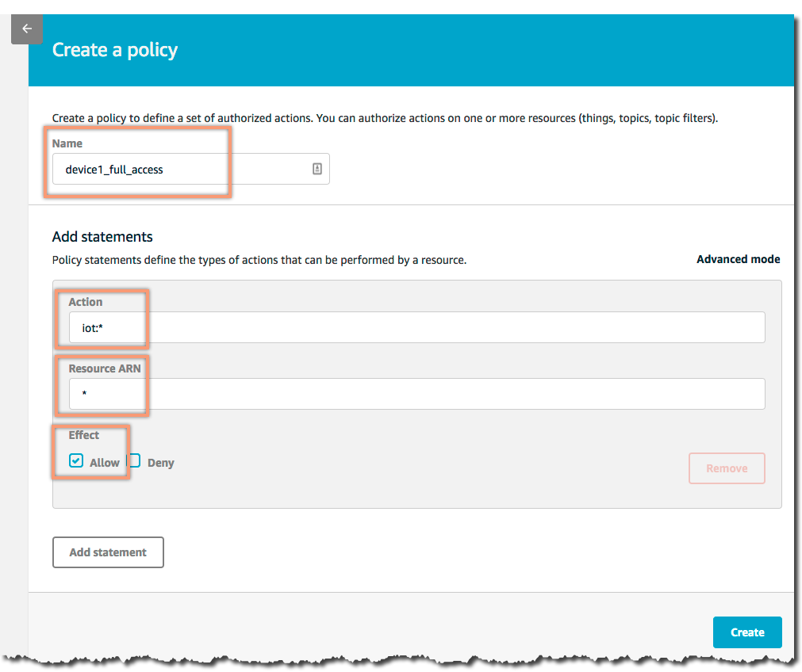
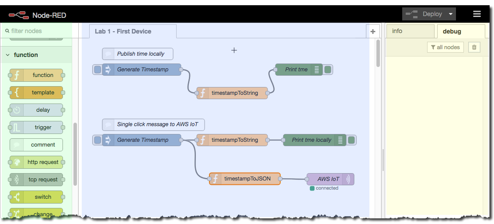
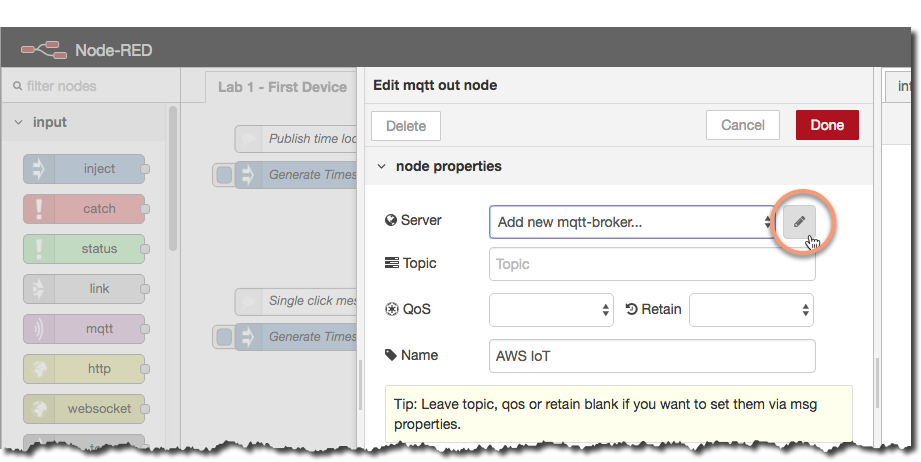
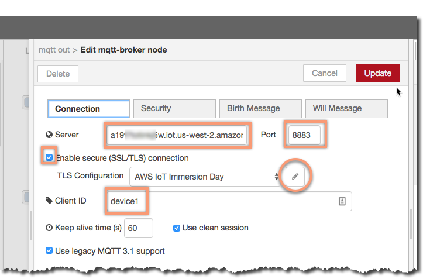
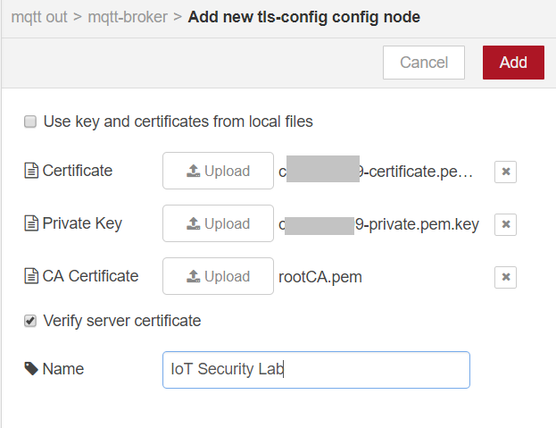
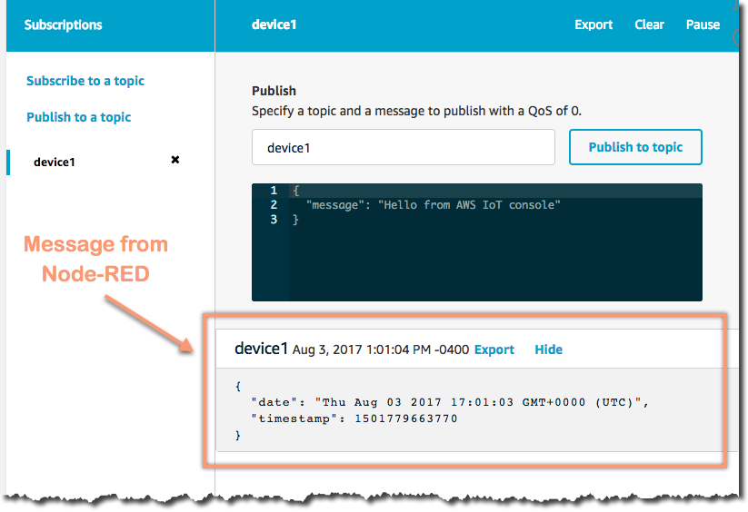
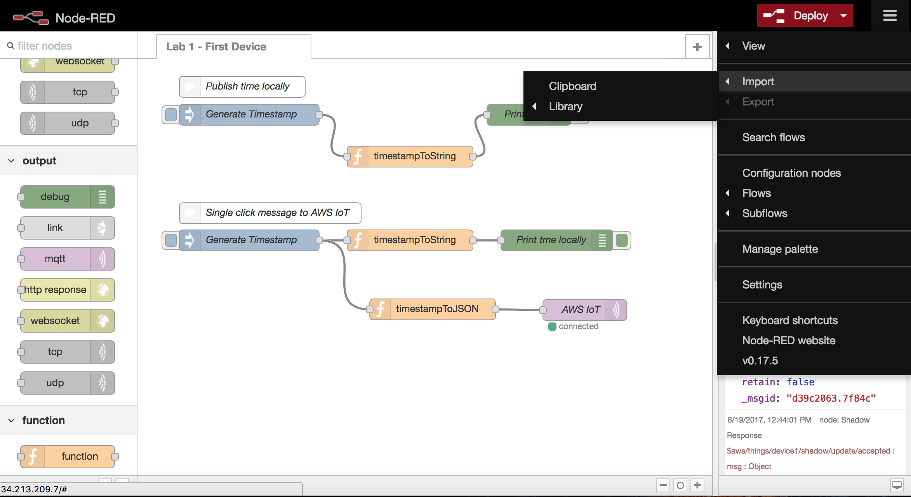
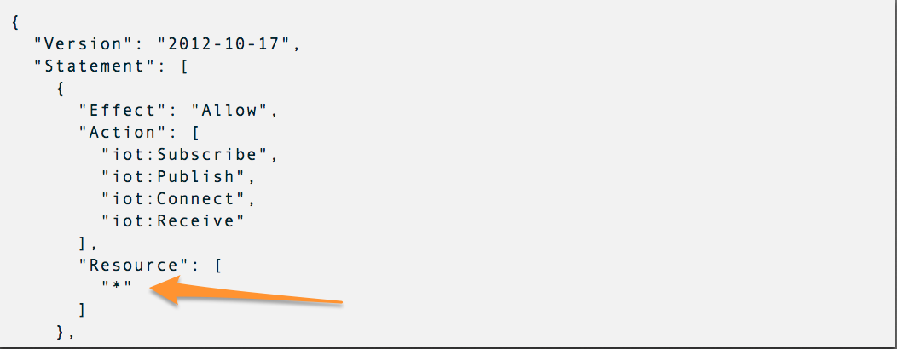
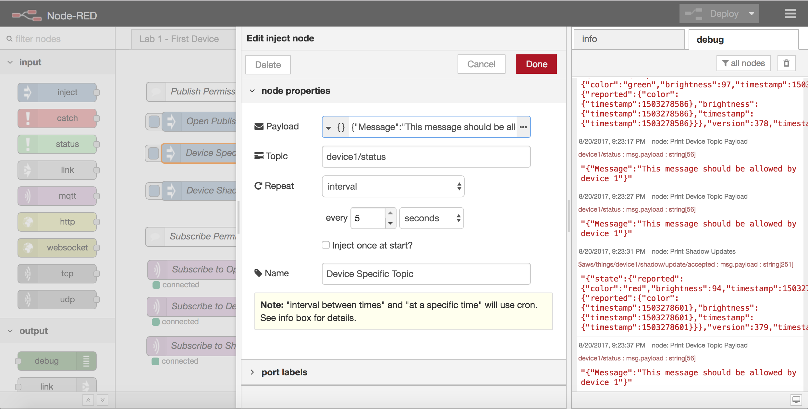

**2017 AWS re:INVENT**

**Implementing Security Controls in the World of Internet, Big Data,
IoT, E-Commerce, and Open Communications Platforms**

**SID402\
**

**Implementing Security with AWS IoT**

Self-Paced Lab

© 2017 Amazon Web Services, Inc. and its affiliates. All rights
reserved. This work may not be reproduced or redistributed, in whole or
in part, without prior written permission from Amazon Web Services, Inc.
Commercial copying, lending, or selling is prohibited.

Errors or corrections? Email us at <aws-course-feedback@amazon.com>.

Other questions? Contact us at
<https://aws.amazon.com/contact-us/aws-training/>

Introduction
============

Overview
--------

In this lab, you will learn how to set up an AWS IoT environment and how
you can provide additional security to AWS IoT by taking advantage of
additional capabilities offered by AWS.

Topics covered
--------------

By the end of this lab, you will be able to:

-   Create a test AWS IoT environment using AWS CloudFormation and the
    open-source package Node-Red.

-   Provision a device (a “thing”) and enable communication between the
    device and AWS IoT.

-   Restrict access to the device (the “thing”).

Prerequisites
-------------

This lab assumes that you have a general knowledge of AWS services
including the use of the AWS Console, AWS CloudFormation, Amazon EC2,
and Amazon VPC. Additionally, you should have

-   Access to an AWS region that offers AWS IoT

-   A user account that can login into the AWS console and has
    administrative privilege or, at a minimum, permissions to do the
    following:

    -   Create and manage AWS CloudFormation stacks

    -   Create and manage Amazon VPC and related components

    -   Create and manage Amazon EC2 t2 instances and associate Elastic
        IP addresses

    -   Create and manage IAM groups and roles

    -   Fully manage AWS IoT

Using Commands, Scripts, or Code from the Lab Instructions
----------------------------------------------------------

Copying text from Word documents or PDF files frequently introduces line
breaks or extra (sometimes hidden) characters when you paste the text
elsewhere. For example, lab instructions sometimes fail because a
student has pasted directly from a PDF into an SSH session, and the
commands weren’t executed properly. We therefore encourage you to type
the commands yourself to help you master core concepts.

Overview of Key Services Used in this Lab
=========================================

AWS IoT
-------

AWS IoT is a managed cloud platform that lets connected devices easily
and securely interact with cloud applications and other devices. AWS IoT
can support billions of devices and trillions of messages, and can
process and route those messages to AWS endpoints and to other devices
reliably and securely. With AWS IoT, your applications can keep track of
and communicate with all your devices, all the time, even when they
aren’t connected. AWS IoT makes it easy to use AWS services like AWS
Lambda, Amazon Kinesis, Amazon S3, Amazon Machine Learning, Amazon
DynamoDB, Amazon CloudWatch, AWS CloudTrail, and Amazon Elasticsearch
Service with built-in Kibana integration, to build IoT applications that
gather, process, analyze and act on data generated by connected devices,
without having to manage any infrastructure.

For further information about using AWS IoT see the official Amazon Web
Services documentation at <https://aws.amazon.com/documentation/iot/>.
For pricing details, see <https://aws.amazon.com/iot-platform/pricing/>.

AWS CloudFormation
------------------

AWS CloudFormation gives developers and systems administrators an easy
way to create and manage a collection of related AWS resources,
provisioning and updating them in an orderly and predictable fashion.
You can use AWS CloudFormation’s sample templates or create your own
templates to describe the AWS resources, and any associated dependencies
or runtime parameters, required to run your application. You don’t need
to figure out the order for provisioning AWS services or the subtleties
of making those dependencies work. CloudFormation takes care of this for
you. After the AWS resources are deployed, you can modify and update
them in a controlled and predictable way, in effect applying version
control to your AWS infrastructure the same way you do with your
software.

For further information about using AWS CloudFormation see the official
Amazon Web Services documentation at
<https://aws.amazon.com/documentation/cloudformation/>. There is no
additional charge for AWS CloudFormation. You pay for AWS resources
created using AWS CloudFormation in the same manner as if you created
them manually.

Select a Region
===============

AWS IoT locations are composed of regions that contain Availability
Zones. Regions are dispersed and located in separate geographic areas
(US, EU, etc.). Availability Zones are distinct locations within a
region that are engineered to be isolated from failures in other
Availability Zones and to provide inexpensive, low-latency network
connectivity to other Availability Zones in the same region.

AWS IoT is currently available in the regions listed in the table below.
You will normally use a region code, for example, “us-west-2,” instead
of a region name like “US West (Oregon)” whenever your lab asks you to
specify your region.

  **Region Name**            **Region Code**   **Endpoint**
  -------------------------- ----------------- ----------------------------------
  US East (N. Virginia)      us-east-1         iot.us-east-1.amazonaws.com
  US East (Ohio)             us-east-2         iot.us-east-2.amazonaws.com
  US West (Oregon)           us-west-2         iot.us-west-2.amazonaws.com
  Asia Pacific (Singapore)   ap-southeast-1    iot.ap-southeast-1.amazonaws.com
  Asia Pacific (Sydney)      ap-southeast-2    iot.ap-southeast-2.amazonaws.com
  Asia Pacific (Tokyo)       ap-northeast-1    iot.ap-northeast-1.amazonaws.com
  Asia Pacific (Seoul)       ap-northeast-2    iot.ap-northeast-2.amazonaws.com
  EU (Frankfurt)             eu-central-1      iot.eu-central-1.amazonaws.com
  EU (Ireland)               eu-west-1         iot.eu-west-1.amazonaws.com
  EU (London)                eu-west-2         iot.eu-west-2.amazonaws.com
  China (Beijing)            cn-north-1        iot.cn-north-1.amazonaws.com

> For more information about regions, see
> <http://docs.aws.amazon.com/general/latest/gr/rande.html>.

Implementing Security with AWS IoT
==================================

Initial Login
-------------

1.  Sign in to the AWS management console at:\
    \
    <https://aws.amazon.com/premiumsupport/knowledge-center/sign-in-console/>

Build the Node Red Environment
------------------------------

Our labs will use AWS CloudFormation to provision a web-based
environment with Node-RED. Node-RED allows you to simulate an IoT device
including the sending and receiving of IoT messages. Based on the AWS
account you are using, you can select one of two CloudFormation
templates links in the table below for deployment. The first column,
Create IoT Lab, creates a complete Amazon VPC and Amazon EC2 instance.
We strongly recommend this option because it will build the entire
environment for you.

If you already have an existing VPC with a public subnet, an Internet
Gateway, and a security group, you can choose the Create IoT Instance
Only link. This link will launch a new Amazon EC2 instance in the public
subnet you specify. The instance for Node-RED must have a public IP
address in a public subnet. Additionally, ports 80 and 443 must be open
in a security group for the instance.

1.  In the row of the table below corresponding to the region you have
    chosen, click (or otherwise open) the Deploy to AWS link in the
    **Create IoT Lab** column to deploy a new Amazon VPC with an Amazon
    EC2 instance for Node-RED. If you want to deploy only Node-RED,
    click (or otherwise open) the link in the **Create IoT Instance
    Only** column.

  --------------------------------------------------------------------------------------------------------------------------------------------------------------------------------------------------------------------------------------
  **Region**                   **Create IoT Lab**                                                                                   **Create IoT**

                                                                                                                                    **Instance Only**
  ---------------------------- ---------------------------------------------------------------------------------------------------- ----------------------------------------------------------------------------------------------------
  N. Virginia (us-east-1)      {width="1.55in" height="0.31in"}   {width="1.55in" height="0.31in"}

  Ohio (us-east-2)             {width="1.55in" height="0.31in"}   {width="1.55in" height="0.31in"}

  Oregon (us-west-2)           {width="1.55in" height="0.31in"}   {width="1.55in" height="0.31in"}

  Singapore (ap-southeast-1)   {width="1.55in" height="0.31in"}   {width="1.55in" height="0.31in"}

  Sydney (ap-southeast-2)      {width="1.55in" height="0.31in"}   {width="1.55in" height="0.31in"}

  Tokyo (ap-northeast-1)       {width="1.55in" height="0.31in"}   {width="1.55in" height="0.31in"}

  Seoul (ap-northeast-2)       {width="1.55in" height="0.31in"}   {width="1.55in" height="0.31in"}

  Frankfurt (eu-central-1)     {width="1.55in" height="0.31in"}   {width="1.55in" height="0.31in"}

  Ireland (eu-west-1)          {width="1.55in" height="0.31in"}   {width="1.55in" height="0.31in"}

  London (eu-west-2)           {width="1.55in" height="0.31in"}   {width="1.55in" height="0.31in"}

  Beijing (cn-north-1)         {width="1.55in" height="0.31in"}   {width="1.55in" height="0.31in"}
  --------------------------------------------------------------------------------------------------------------------------------------------------------------------------------------------------------------------------------------

1.  A new browser tab or page will appear with the CloudFormation
    template selected. Click on **Next** to start populating the fields
    listed below.

-   **Stack Name**: Name to reference the stack and resources (default:
    IoTSecurityLab)

-   **Allowed IP Range**: The IP address range that can be used to SSH
    and connect to the EC2 instance (default is 0.0.0.0/0 which is all
    IPv4 addresses – be cautious for long term access)

-   **Instance Type**: Size of instance to deploy (t2.micro is the
    default)

-   **Public Subnet**: A subnet in your VPC where the instance can use a
    public IP address

> Click on **Next**.

1.  On the next page, you can create tags to be applied to resources,
    then click **Next**.

2.  Review the settings. If requested, click the check box to
    acknowledge that IAM resources may be created and then click
    **Create**. The process will take five to seven minutes to complete.

3.  Go back to the CloudFormation console, select the stack. After the
    stack build is complete, the outputs tab will have two keys:

-   **HostIPAddress**: The IP address of the EC2 instance

-   **NodeREDURL**: The URL of the EC2 instance

1.  While the stack is building, proceed to the next page to create your
    first AWS IoT device (a “thing”).

[]{#_Toc491689210 .anchor}

Create Device
=============

{width="1.0in" height="1.0in"}In this
section you will create a Device (an IoT “thing”), the policy for it,
and generate, download, and attach a client certificate to allow full
access.

> For this lab and all other, you will create a device name unique to
> you if multiple users are sharing an AWS account. When you see
> reference to *yourname*, use something short and unique that will be
> used for all labs. For screen shots, replace **device1** with your
> name plus the name, e.g., **jsmith\_device1**. This applies to all
> references in this document to **device1**.

1.  Select the *service* **AWS IoT** from the AWS Console. If you see a
    **Get started** button, click that.

2.  From the menu on the left, select **Registry**-&gt;**Things** and
    the click the **Register a thing** button (if there are already
    things listed, click the **Create** button instead):

3.  Enter the name yourname\_device1 and click **Create thing**.

4.  On the left select **Security**, then click **Create a certificate**
    and then Click **Create certificate.**

5.  This step will generate the client certificate, private key, and
    public key. Use the download links to download to a folder on your
    system. Also download the root CA from the link above the Activate
    button by right-clicking and saving the file as **rootCA.pem**. Once
    done and verified you have the files locally save, click
    **Activate** and then **Attach a policy**. A copy of the screen
    appears below.

{width="5.99in"
height="3.82in"}{width="1.0in"
height="1.0in"}

> At this point a new device has been created and the authorization and
> authentication credentials to be used associated with the device.
> Download the certificate, the public key, the private key, and CA
> Certificate and save them to a directory you can easily reference
> later related to the labs.

1.  On the Add authorization to certificate page, click **Create new
    policy**.

2.  On the **Create a policy** page create the statement as follows:

{width="5.494385389326334in"
height="4.608634076990376in"}

-   **Name:** yourname\_device1\_full\_ access

-   **Action**: iot:\*

-   **Resource** **ARN**: \*

-   **Effect**: Allow

> This creates an AWS IoT policy granting full access to all IoT
> resources. For a short term lab environment, this is usually
> reasonable. You should use more granular­ permissions for a longer
> term environment.

1.  Select **Create**.

2.  From the main AWS IoT menu, select **Security Certificates.**

3.  Select the certificate that you created above by hovering over the
    certificate and checking the blue box that appears. With it checked,
    select the drop-down menu **Actions** and click on **Attach
    policy**. Then select the **yourname\_device1\_full\_access** policy
    and click **Attach**. You have now attached the policy to the
    certificate.

4.  Select the drop-down menu **Actions** and click on **Attach thing**
    and select the thing named **yourname\_device1**. Click **Attach**.
    You have now attached the certificate with its policy to the device.

5.  From the console home page, near the bottom left click Settings.
    Copy the **Endpoint** and save it in a text file. This endpoint
    fully qualified domain name will be used later to connect the MQTT
    thing, Node-RED, to the AWS IoT service in the current region.

Configure Node-RED
==================

1.  By this point, the CloudFormation stack with the Node-RED Amazon EC2
    instance should be complete Go to the AWS CloudFormation console,
    select the stack and look at the output tab to see the URL Browse to
    the URL and you should see Node-RED appear.

{width="7.0in"
height="3.1902777777777778in"}

For this lab you will see the following three sections on the interface,
from left to right:

-   Nodes – Drag and drop different types of nodes to the canvas

-   Flow Canvas – Position, link, and configure nodes for different
    operations. It the case of this lab, it is publishing a date/time
    locally and then to AWS IoT

-   Info/Debug – The info tab will provide more details on the selected
    node, while the debug tab will show in real time all activity for
    the debug nodes.

If not already selected, at the top of the page, click on the **First
Device** tab. This will display the two flows to be tested. The first
flow, **Publish time locally**, will generate a timestamp, then have
that converted to a friendly date and time, and then finally print the
time to the debug window. The second flow will do the same, except you
will see there is an additional output to be configured to send the
message to the AWS IoT service.

First flow – locally execute time
---------------------------------

1.  On the right side of the make sure the debug tab is selected.

2.  On the Generate Timestamp node for Publish time locally, click the
    button on the left side. This will generate the timestamp, then
    convert and send. You will see the message in the debug frame. Every
    click on the inject node (Generate Timestamp) will publish a message
    in the debug window.

{width="7.0in"
height="3.4444444444444446in"}

Second flow – send time to AWS IoT
----------------------------------

1.  Now click the button for the second inject node under the **Single
    click message to AWS IoT**. This will also publish a message in the
    debug window, but for now will not publish to AWS IoT as that node
    is not configured (red alert icon on the **AWS IoT** node).

2.  To configure the AWS IoT node, double-click it. This will bring up
    the main MQTT properties. First you will need to configure the MQTT
    broker (AWS IoT platform).

3.  Click the pencil icon next to *Add new mqtt-broker* which will bring
    up the configuration window:

{width="4.803775153105862in"
height="2.4095122484689413in"}

{width="5.632142388451443in"
height="3.7156496062992126in"}

1.  On the Connection tab, configure the following:

-   **Server**: Endpoint value from above (e.g.,
    a2XXXky.iot.us-west-2.amazonaws.com)

-   **Port**: 8883

-   Enable secure (SSL/TLS) connection: checked

-   **Client ID**: yourname\_device1

1.  When you check the SSL/TS connection, it will bring up selecting or
    adding a new TLS configuration. As this is the first time, click the
    pencil next to the Add new tls-config dropdown, which will bring up
    this window:

> {width="3.9in" height="3.0in"}

1.  On the Add new-tls-config screen, make sure the **Use key and
    certificates from local files** is deselected (which would be files
    on the Node-RED server you are connected to), and instead select the
    Upload button for each and navigate to the directory where the files
    are saved. The files will have names similar to the following:

-   **Certificate**: c1234567-certificate.pem

-   **Private Key**: c1234567-private.pem.key

-   CA Certificate: rootCA.pem

-   Verify server certificate: selected

-   **Name**: IoT Security Lab

1.  Then click **Add**, which will bring you back to the mqtt-broker
    configuration screen, with the AWS IoT Immersion Day TLS
    configuration select.

2.  From the mqtt-broker page, click **Add**, which brings you back to
    the Edit mqtt out node page, now with the Server selected
    (yourname\_device1@a24XXX….)

3.  For the Topic field, enter: **yourname\_device1** and select **0**
    for the QoS (Quality of service):

{width="4.803775153105862in"
height="3.3478685476815397in"}

-   **Server:** completed value of the MQTT endpoint with its TLS
    configuration

-   **Topic:** yourname\_device1

-   QoS: 0

-   **Name:** AWS IoT

1.  Select **Done** to go back to the main GUI. The AWS IoT node should
    now have a blue dot instead of red alert icon.

2.  Finally, notice that the **Deploy** icon in the upper right of the
    GUI is red. This means changes have been made and need to be
    deployed. Select **Deploy** and the flow will be saved, validated,
    and ready for use. If validation succeeds, the AWS IoT node will
    connect to the AWS IoT platform. You should see a green icon with
    “connected” under the AWS IoT node, meaning it has a connection and
    authorization to the service.

> {width="1.0in" height="1.0in"}There is a
> chance of a typo or other small misconfiguration will display an error
> in the debug tab, or not show a connection to AWS IoT. To correct,
> double-click the AWS IoT node, then verify and Update the parameters
> for the MQTT, endpoint, and security.[]{#_Toc491689213 .anchor}Monitor
> Messages in AWS IoT Console

1.  Bring up the AWS Console in a new browser window or tab and navigate
    to the AWS IoT console and select **Test**. Then select Subscribe to
    a topic link, enter **yourname\_device1** as the topic, and finally
    click the Subscribe to topic button. This will then bring up a real
    time client monitoring the topic for new messages.

{width="5.803775153105862in"
height="2.40834208223972in"}

{width="5.269790026246719in"
height="3.3542629046369203in"}

1.  Now click on the Generate Timestamp button for the Single click
    message to AWS IoT. You will see the friendly date and time posted
    in the debug window, but you will also see the message published in
    the MQTT client in the AWS Console.

{width="5.803775153105862in"
height="3.2732600612423446in"}

{width="5.259260717410323in"
height="3.6042629046369203in"}

> You have now done the following:

-   Defined an IoT device (a “thing”)

-   Created a certificate which has full access to AWS IoT

-   Launched a Node-RED instance on AWS and configured Node-RED with the
    certificate information from AWS IoT, thereby enabling the Node-RED
    instance to communicate with AWS IoT

-   Captured traffic from Node-RED within AWS IoT

> You will now learn how to restrict access to AWS IoT.

[]{#_Toc491424797 .anchor}

Restricting Open Topics in AWS IoT
==================================

Import Lab into your Node-RED environment
-----------------------------------------

1.  In this portion of the lab, you will create a new flow in Node-RED.
    Flows in Node-RED are visually displayed as individual tabs in the
    workstation. You currently have only one flow named **First
    Device**. To start the lab, first download the starting
    configuration for this lab which can be found at this link:

AWS IoT Security Node-RED Configuration File

> If your browser displays the contents of the file, save the contents
> into a file named **SID402IoT.json**. Use your favorite text editor to
> do a global search/replace for **yourname\_device1** to the name you
> have been using above.

1.  Prior to importing the JSON file as a new flow, you will need to
    disable the **First Device** flow to prevent it from interacting
    with the security lab. If you do not disable it, you will see the
    MQTT connections flip back and forth between *connected* and
    *disconnected*. To disable the flow, double-click on the **First
    Device** tab, and then toggle the disable switch, then select
    **Done**. The screenshot below illustrates how the flow should look
    after you disable it.

> {width="3.97in" height="1.98in"}

1.  After you disable the flow click the red **Deploy** button to
    disable the flows and stop them from interacting with the AWS IoT
    platform.

2.  Open the **SID402IoT.json** file and copy the contents to your
    clipboard.

3.  Now you will add the lab to the Node-RED UI by selecting the
    **menu** option, Import &gt; Clipboard.\
    \
    {width="6.428775153105862in"
    height="3.51455927384077in"}

4.  On the Clipboard, window, click the **new flow** button to ensure
    your workflow is added to a new tab. Paste the clipboard contents of
    the JSON file into the window.

> {width="6.324260717410324in"
> height="3.2292629046369203in"}

1.  Select **Import**. Your lab should have a similar set up as the
    below. Select the **IoT Security** flow by clicking on its tab.

{width="5.821224846894138in"
height="2.982222222222222in"}

1.  Before continuing, you will need to select all six of the MQTT nodes
    highlighted above and change the following:

> {width="5.81875in"
> height="2.721188757655293in"}

-   **Server:** Select the previously configured endpoint

-   **Topic:** In all of the nodes, replace youname\_device1 with the
    unique device name (e.g., jsmith\_device1). If you did the search
    and replace in the JSON file, just verify the topic names.

1.  Once all nodes have been updated, Select **Deploy** to deploy your
    lab. You should see device logs start to be displayed in the debug
    window showing immediate device communication.

Denying Communication on Open Topics
------------------------------------

When you first created your device, AWS IoT used a default policy that
allows any AWS IoT action on any topic. During early testing, a more
open and permissive set of policies are fine as you are iterating on
your test environment. However, as you start moving applications to
staging, and begin to tie in your operations and security, you should
move to employing the most restrictive policies per device. Restrictive,
fine-grained policies ensure devices cannot communicate over topics that
they should not be allowed to use.

For this section, we are going to remove the “Open publish policy” that
are Node-RED Lab is currently using for publishing and subscribing. This
will morph into creating fine grained permissions for your device1 over
a specific device topic and the device’s AWS IoT Shadow.

1.  View the debug log in Node-RED and look for a message payload
    similar to the below:

> {"Message": "This message should be denied"}
>
> This message is published on the topic
> “publish/any/topic/yourname\_device1”, which is a topic that we will
> deny in this lab.

1.  Open your browser and go to the AWS console. Select the *service*
    **AWS IoT**. Then select **Security**-&gt;**Policies** and the click
    on the policy **yourname\_device1\_full\_access**. This will display
    the base details about the current IoT security permissions on
    device1. Notice the permissions allow full access. Before navigating
    back Policies page, copy the region and account number from the ARN
    (e.g., us-west-2:123456789012).

2.  To restrict our device to only communicate over specific topics, you
    will first create a new policy and add an explicit Deny for
    publishing on the “publish/any/topic/yourname\_devices”. Click
    Create which will open the window to create a new policy. For the
    name, enter: **yourname\_deny\_publish**, and click on the
    **Advanced mode** which will bring the editor.

3.  Modify the policy to mirror the below, then copy and paste over the
    existing JSON. You will need to replace the AWS\_REGION with your
    specific AWS Region (for example, us-west-2),change the ACCOUNT\_ID
    to match your AWS Account Id, and replace yourname1\_device with
    your device name.

> {
>
> "Version": "2012-10-17",
>
> "Statement": \[
>
> {
>
> "Effect": "Allow",
>
> "Action": \[
>
> "iot:Subscribe",
>
> "iot:Publish",
>
> "iot:Connect",
>
> "iot:Receive"
>
> \],
>
> "Resource": \[
>
> "\*"
>
> \]
>
> },
>
> {
>
> "Effect": "Deny",
>
> "Action": \[
>
> "iot:Publish"
>
> \],
>
> "Resource": \[
>
> "arn:aws:iot:&lt;AWS\_REGION&gt;:&lt;AWS-ACCOUNT\_ID&gt;:topic/publish/any/topic/yourname\_device1"
>
> \]
>
> }
>
> \]
>
> }

1.  Once the policy has been entered, click **Create**. Now navigate to
    Security-&gt;Certificates-&gt;Policies and select your certificate.
    You are going to attach the new policy to the certificate and detach
    the *yourname\_device\_full\_access* policy.

2.  Under Actions select Attach policy and select the **deny\_publish**
    policy. You will now have two policies connected. On the three dots,
    click and select Detach for the **full\_access** policy.

> {width="5.191275153105861in"
> height="2.1012303149606297in"}

1.  Navigate to Node-RED in your browser and make sure you are
    displaying the IoT Security tab. Clear the debug window and after a
    few minutes, you will notice that Node-RED will begin to frequently
    disconnect over MQTT. And you’ll begin to see “disconnected” show in
    your workflow. Very similar to the below screenshot:

> {width="7.0in"
> height="3.4944444444444445in"}

1.  This disconnect is expected behavior. What is occurring is that you
    have removed the ability for device1 to publish on
    “publish/any/topic/yourname\_device1”. In Node-RED, the device
    attempts to publish a message on that topic and whenever a message
    is published, AWS IoT denies the message and disconnects the device.
    Node-RED then starts from the top to try to reconnect.

2.  This issue can be resolved by selecting the **Open Topic** MQTT Node
    in Node-RED and deleting it using the “delete” key on your laptop.
    Then Select **Deploy** to deploy your changes. Make make sure you
    delete only the node referenced below by the arrow.

{width="6.428775153105862in"
height="4.583053368328959in"}

[[]{#_Toc493451693 .anchor}]{#_Toc491424800 .anchor}

Create Allow Permissions for Device Specific Topics
---------------------------------------------------

Although an explicit deny achieves the result of denying access to a
specific topic, best practices for AWS IoT is to only explicitly “Allow”
topics that are required for your device to communicate. If you review
the current IoT policy, you’ll notice that it still allows a Publish on
any topic except for “publish/any/topic/yourname\_device1” by using “\*”
in the resource name.

{width="6.303775153105862in"
height="2.4520931758530184in"}

In this next section, you will create a more specific policy to “Allow”
publishing messages for yourname\_device1.

1.  Open your browser and go to the AWS console. Select the *service*
    **AWS IoT**. Then select **Security**-&gt;**Policies** and the click
    on the device **device1\_full\_access**. This will display the
    updated details about the current IoT device.

2.  To explicitly allow your device to only communicate over specific
    topics, we will add an explicit Allow for publishing on the
    “yourname\_device1/status” and also allowing “Publish” for device1’s
    Shadow.

3.  Create a new policy named **yourname\_allow\_publish**, click the
    Advanced mode and replace the JSON with the content below, replacing
    AWS\_REGION, ACCOUNT\_ID, and the device name in a similar manner as
    above. Note that two lines are affected.

> {
>
> "Version": "2012-10-17",
>
> "Statement": \[
>
> {
>
> "Effect": "Allow",
>
> "Action": \[
>
> "iot:Subscribe",
>
> "iot:Connect",
>
> "iot:Receive"
>
> \],
>
> "Resource": \[
>
> "\*"
>
> \]
>
> },
>
> {
>
> "Effect": "Allow",
>
> "Action": \[
>
> "iot:Publish"
>
> \],
>
> "Resource": \[
>
> "arn:aws:iot:&lt;AWS\_REGION&gt;:&lt;AWS-ACCOUNT\_ID&gt;:topic/yourname\_device1/status",
>
> "arn:aws:iot:&lt;AWS\_REGION&gt;:&lt;AWS-ACCOUNT\_ID&gt;:topic/\$aws/things/yourname\_device1/shadow/update"
>
> \]
>
> }
>
> \]
>
> }

1.  2.  Click **Create**, then as before, navigate to
    **Security-&gt;Certificates** and select your certificate then click
    on **Policies**. Now select **Attach policy** under Actions and
    select **yourname\_allow\_publish**. Then detach the deny policy
    from the certificate.

3.  Navigate back to the Node-RED console, clear the debug windows and
    you should notice that the device continues to successfully
    communicate over MQTT and is not being disconnected for
    authentication issues. You have successfully created a set of IoT
    permissions that reduce the scope of what a device can send to AWS
    IoT.

Create Allow and Deny Permissions for Subscribe and Receive
-----------------------------------------------------------

In this final section you will create a set of policies that will allow
your device to “subscribe” to a set of topics, but not let it receive
any messages from AWS IoT. The receive action is checked whenever a
message is sent to a device. By the end of this lab, your device will
still be subscribed to the AWS IoT service, but it will not be able to
receive any messages.

1.  Open your browser and go to the AWS console. Select the *service*
    **AWS IoT**. Then select **Security**-&gt;**Policies** and create a
    new policy called **yourname\_restricted\_access**. As above, in
    Advance mode replace the JSON with the content below, replacing
    AWS\_REGION, ACCOUNT\_ID, and yourname\_device. As there are six
    lines that need to be chagned, it may be easier to make the changes
    in a text editor before copy and pasting into the policy.

> {
>
> "Version": "2012-10-17",
>
> "Statement": \[
>
> {
>
> "Effect": "Allow",
>
> "Action": \[
>
> "iot:Connect",
>
> "iot:Receive"
>
> \],
>
> "Resource": \[
>
> "\*"
>
> \]
>
> },
>
> {
>
> "Effect": "Allow",
>
> "Action": \[
>
> "iot:Publish"
>
> \],
>
> "Resource": \[
>
> "arn:aws:iot:&lt;AWS\_REGION&gt;:&lt;ACCOUNT\_ID&gt;:topic/yourname\_device1/status",
>
> "arn:aws:iot:&lt;AWS\_REGION&gt;:&lt;ACCOUNT\_ID&gt;:topic/\$aws/things/yourname\_device1/shadow/update",
>
> "arn:aws:iot:&lt;AWS\_REGION&gt;:&lt;ACCOUNT\_ID&gt;:topic/publish/any/topic/yourname\_device1"
>
> \]
>
> },
>
> {
>
> "Effect": "Allow",
>
> "Action": \[
>
> "iot:Subscribe"
>
> \],
>
> "Resource": \[
>
> "arn:aws:iot:&lt;AWS\_REGION&gt;:&lt;ACCOUNT\_ID&gt;:topicfilter/yourname\_device1/status",
>
> "arn:aws:iot:&lt;AWS\_REGION&gt;:&lt;ACCOUNT\_ID&gt;:topicfilter/\$aws/things/yourname\_device1/shadow/update/\*",
>
> "arn:aws:iot:&lt;AWS\_REGION&gt;:&lt;ACCOUNT\_ID&gt;:topicfilter/publish/any/topic/yourname\_device1"
>
> \]
>
> }
>
> \]
>
> }

1.  Click Create, then as above, navigate to your certificate and attach
    the **yourname\_restricted\_access** policy and then detach the
    **yourname\_allow\_publish** policy.

2.  In AWS IoT, subscribe actions are only checked at the time a device
    initiates a subscribe request. For Node-RED, subscribe requests only
    happen after a deployment. In order to trigger this behavior and
    confirm everything is working successfully you will manually change
    a node in Node-RED and then deploy.

3.  Go to Node-RED in your browser and select the tab for “IoT
    Security”. Then Double-click the **Device Specific Topic** node to
    open up the editor.

4.  Once the editor is open, change the interval from 10 seconds to 5
    seconds which will increase the frequency that Node-RED publishes
    this sample message to AWS IoT. You can see what the window looks
    like in the image below. Select **Done** to close the panel.

> {width="5.74627624671916in"
> height="2.913669072615923in"}

1.  Select **Deploy** to update your new version. If all works
    successfully, Node-RED is able to connect and subscribe to AWS IoT
    without immediately disconnecting. This works successfully as you
    have explicitly allowed this lab to communicate only to its specific
    topics.

2.  View the Node-RED console and clear the debug window. You should
    still see messages from AWS IoT to Node-RED. In this last set of
    steps, you will disable the “receive” permissions for the device
    which will still allow Node-RED to publish and subscribe, but will
    deny any messages being sent over those topics to be delivered to
    your end device.

3.  Open your browser and go to the AWS console. Select the *service*
    **AWS IoT**. Then select **Security**-&gt;**Policies** and the click
    on the device **yourname\_restricted\_access**. Click the **edit
    policy document** link which will open up an editor in your browser

4.  Add the following action to the bottom of your current Statement
    array in your IoT policy. You will need to replace the AWS\_REGION,
    ACCOUNT\_ID and yourname\_device1 as above. In this case we are
    modifying the policy instead of creating a new one. You will need to
    add a comma to the current of the existing statement before
    inserting the code below. Look for the second to the last right
    brace ( “}” ).

> {
>
> "Effect": "Deny",
>
> "Action": \[
>
> "iot:Receive"
>
> \],
>
> "Resource": \[
>
> "arn:aws:iot:&lt;AWS\_REGION&gt;:&lt;ACCOUNT\_ID&gt;:topic/yourname\_device1/status",
>
> "arn:aws:iot:&lt;AWS\_REGION&gt;:&lt;ACCOUNT\_ID&gt;:topic/\$aws/things/yourname\_device1/shadow/update/accepted",
>
> "arn:aws:iot:&lt;AWS\_REGION&gt;:&lt;ACCOUNT\_ID&gt;:topic/publish/any/topic/yourname\_device1"
>
> \]
>
> }

1.  Next, remove the “iot:Receive” action from the very first IoT
    statement in your array. Similar to the previous section, you do not
    want to leave “Receive”: “\*” as an option in your more scoped down
    policy. Your final policy will be similar to the below, with the
    AWS\_REGION and ACCOUNT\_ID specific to your policy:

> {
>
> "Version": "2012-10-17",
>
> "Statement": \[
>
> {
>
> "Effect": "Allow",
>
> "Action": \[
>
> "iot:Connect"
>
> \],
>
> "Resource": \[
>
> "\*"
>
> \]
>
> },
>
> {
>
> "Effect": "Allow",
>
> "Action": \[
>
> "iot:Publish"
>
> \],
>
> "Resource": \[
>
> "arn:aws:iot:&lt;AWS\_REGION&gt;:&lt;ACCOUNT\_ID&gt;:topic/yourname\_device1/status",
>
> "arn:aws:iot:&lt;AWS\_REGION&gt;:&lt;ACCOUNT\_ID&gt;:topic/\$aws/things/yourname\_device1/shadow/update",
>
> "arn:aws:iot:&lt;AWS\_REGION&gt;:&lt;ACCOUNT\_ID&gt;:topic/publish/any/topic/yourname\_device1"
>
> \]
>
> },
>
> {
>
> "Effect": "Allow",
>
> "Action": \[
>
> "iot:Subscribe"
>
> \],
>
> "Resource": \[
>
> "arn:aws:iot:&lt;AWS\_REGION&gt;:&lt;ACCOUNT\_ID&gt;:topicfilter/yourname\_device1/status",
>
> "arn:aws:iot:&lt;AWS\_REGION&gt;:&lt;ACCOUNT\_ID&gt;:topicfilter/\$aws/things/yourname\_device1/shadow/update/\*",
>
> "arn:aws:iot:&lt;AWS\_REGION&gt;:&lt;ACCOUNT\_ID&gt;:topicfilter/publish/any/topic/yourname\_device1"
>
> \]
>
> },
>
> {
>
> "Effect": "Deny",
>
> "Action": \[
>
> "iot:Receive"
>
> \],
>
> "Resource": \[
>
> "arn:aws:iot:&lt;AWS\_REGION&gt;:&lt;ACCOUNT\_ID&gt;:topic/yourname\_device1/status",
>
> "arn:aws:iot:&lt;AWS\_REGION&gt;:&lt;ACCOUNT\_ID&gt;:topic/\$aws/things/yourname\_device1/shadow/update/accepted",
>
> "arn:aws:iot:&lt;AWS\_REGION&gt;:&lt;ACCOUNT\_ID&gt;:topic/publish/any/topic/yourname\_device1"
>
> \]
>
> }
>
> \]
>
> }

1.  Click **Save as New Version**. Go to Node-RED in your browser and
    select the tab for “IoT Security”. Wait for a few minutes as the
    policy is updated in AWS IoT. Then select the “clear button” to
    clear your logs.

> {width="5.376388888888889in"
> height="2.525in"}

1.  You can continue to clear your logs until the changes take effect.
    After some time you’ll notice that Node-RED is no longer receiving
    and logging messages to the debug log. This is due to AWS IoT’s Deny
    on the Receive policy that will not deliver a message to an IoT
    device unless given explicit permissions to do so. iot:Receive is
    checked on every single message delivery from AWS IoT down to a
    device.

Conclusion
==========

Congratulations! You have now successfully:

-   Configured a device (a “thing”) in AWS IoT

-   Launched an Amazon EC2 instance with the Node-RED platform

-   Associated Node-Red with the IoT device by attaching a certificate

-   Captured traffic from Node-RED with AWS IoT

-   Configured AWS IoT security policies to restrict actions from IoT
    devices

Clean Up Lab
============

To clean up the lab environment, follow the remaining steps.

1.  Delete the AWS CloudFormation stack you previously launched.

2.  Remove all IOT configuration items (things, certificates, policies).
