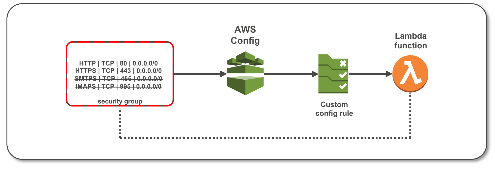
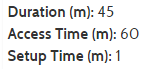
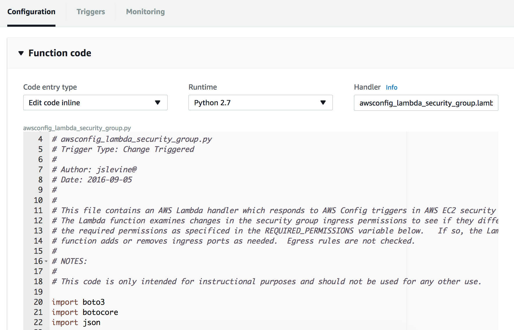
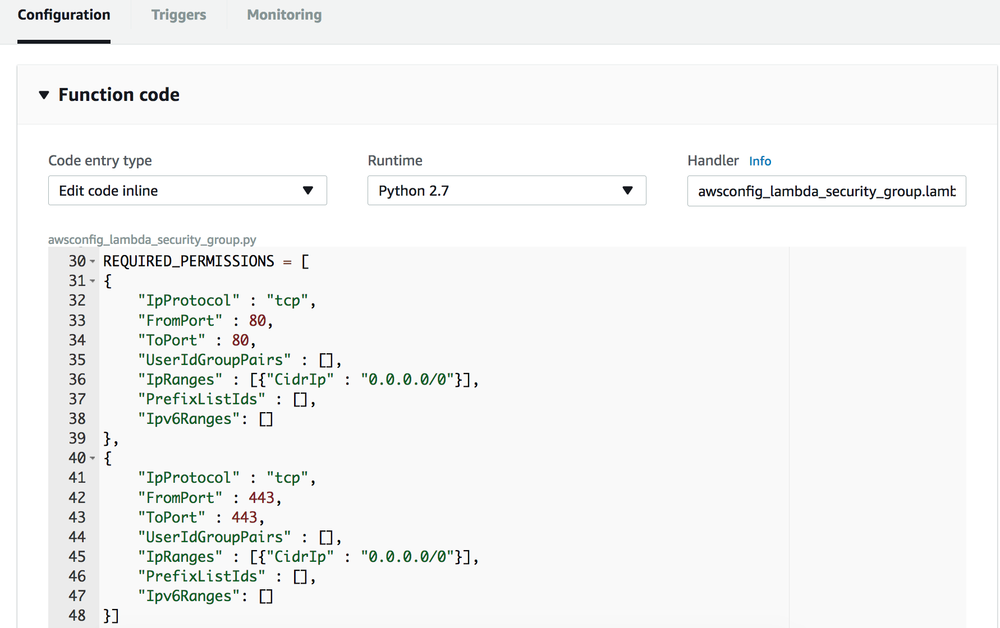
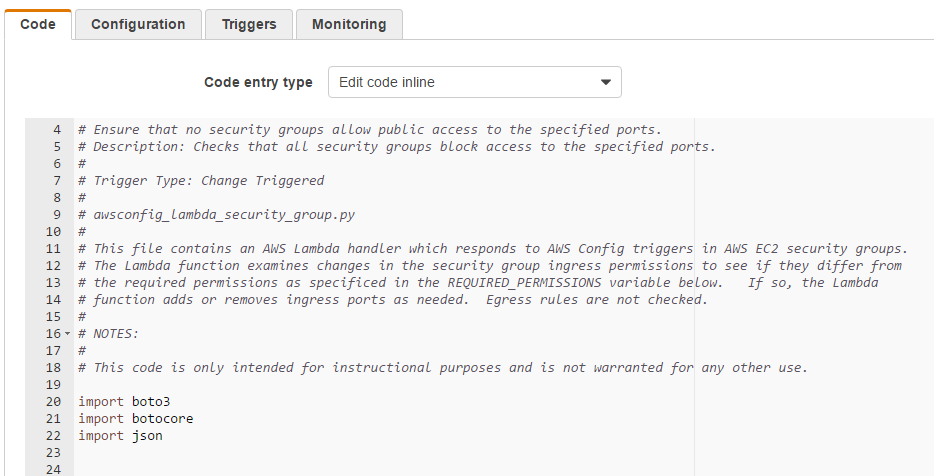
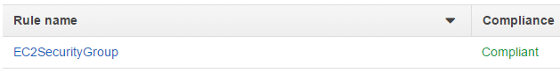
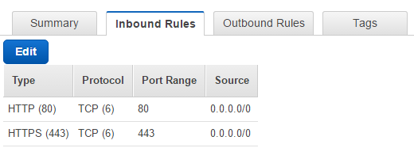

## re:Invent 2017 - SID402

# Module 3 - Automating Security Remediation in AWS

### Introduction

The Security Enhancement Project at IthaCorp is continuing to progress and you decide its time to implement responsive controls in order to automate remediation of security baseline deviations. This will help reduce overhead on the engineering team and allow them to focus on several strategic initiatives.

#### Monitoring Security Groups with AWS Config

In this lab you will learn how to use AWS Config Rules with an AWS Lambda function to monitor the ingress ports associated with an EC2 security group.   The Lambda function will be triggered whenever the security group is modified.  If the ingress rule configuration differs from that which is coded in the function, the Lambda function will revert the ingress rules back to the appropriate configuration.  The activity from the Lambda function can then be viewed through Amazon CloudWatch Logs.  In an accompanying lab, Monitoring Security Groups with Amazon CloudWatch Events, you will use a different set of services to monitor security groups.  These two labs demonstrate techniques that can be used to provide additional layers of protection to infrastructure assets.

#### Architecture Overview



### Topics covered

By the end of this module, you will be able to:

1.  Upload a preconfigured Lambda function

2.  Enable AWS Config

3.  Create and enable a custom AWS Config rule

4.  Use CloudWatch Logs to review the execution of the AWS Config rule

### Prerequisites

To successfully complete this module, you should be familiar with EC2 security groups. Python programming skills are helpful, although full solution code is provided.

### 1. Select a Region

Login to the AWS Console. Make sure that the user has "Admin" rights to the AWS services. Not using an Admin user will create permission issues during the module. Make a note of the AWS *region name*, for example, *US West (Oregon),*

**Tip** The AWS region name is always listed in the upper-right corner of the AWS Management Console, in the navigation bar.

For more information about regions, see [AWS Regions and Endpoints](http://docs.aws.amazon.com/general/latest/gr/rande.html).

___Complete all the steps below unless they are marked "optional". Use left arrow to expand sections marked with (expand for details).___

### 2. Complete Initial Environment Configuration

<details>
<summary><strong>2.1. Enable AWS Config (expand for details)
</strong></summary><p>
<br/>

- __2.1.1.__  On the **Services** menu, click **Config**.

- __2.1.2.__  Click **Get Started** if you see a button with that text, else click
    **Settings**.

- __2.1.3.__  Under Resource types to record, *uncheck* the box **Record all resources supported in this region**.

- __2.1.4.__  Click inside of the **Specific types** box. A scroll box field will appear. Scroll down to the EC2 section and click **SecurityGroup**. You should see **EC2: Security Group** appear in the **Specific types** box. Click outside of the box to close the scroll box field.

- __2.1.5.__  Under **Amazon S3 bucket**, select **Create a bucket**. In the **Bucket name** field, use the default name that is provided. Leave the **Prefix (optional)** text box empty. *Make sure that the Bucket Name is not already created else you will get a bucket already exist error.*

- __2.1.6.__  Under **AWS Config Role**, select **Create a Role**. In the **Role name** field, use the default name that is provided.

- __2.1.7.__  Click the **Next** button at the bottom right of the web page.

- __2.1.8.__  On the **AWS Config Rules** page, do not select any rules. You will add a custom rule later. Click **Next**.

- __2.1.9.__  On the **Review** page, click **Confirm.** After a while, you will see the **Config Dashboard** page appear.



- __2.1.10.__  Under **AWS Config on the left panel**, click the **Resources** button. A scrollable window will appear with a list of check boxes. Select (check) all of them (be sure to scroll the entire window down as some may be hidden). Make sure you select (check) **SecurityGroup.** Click **Look Up**. You will see a message telling you that resources are being loaded.

Notice that many resources appear in addition to **EC2 Security Group** even though we told AWS Config in step 9 to record the resource type **EC2 Security Group**. The reason for this is that AWS Config also tracks resources *related to* the resource we are primarily interested in because those related resources can affect the behavior of the primary resources, in this case EC2 security groups, which are being tracked. Many of these related resources are part of the environment in which you are working. We are now going to configure the settings of the default security group that has already been installed for you.
</details>

<details>
<summary><strong>2.2. Create an EC2 Security Group (expand for details)
</strong></summary><p>
<br/>

- __2.2.1.__ Click the **Services** menu and select **VPC.** The **VPC Dashboard** will appear.

- __2.2.2.__ On the left hand side of the window click **Security Groups**.

- __2.2.3.__ Click **Create Security Group button**.

- __2.2.4.__ In the **Name tag** text box, enter "SID402Module3SG". The **Group name** text box should populate automatically.

- __2.2.5.__ In the Description text box, enter Module 3 Security Group. Keep the default VPC in the **VPC** drop down list.

- __2.2.6.__	Click **Yes, Create** button.

- __2.2.7.__	Select the **SID402Module3SG** Security Group.

- __2.2.8.__	Click on the **Inbound Rules** tab and click the **Edit** button.

- __2.2.9.__	Click in the field under **Type** column and change the type to **HTTP (80)**.  Under the **Source** column, click in the field and enter **0.0.0.0/0** and then click the **Add another rule** button. The default VPC Security Group has this rule added by default normally. If it is already there, skip to next step.

- __2.2.10.__	Click in the field under **Type** column for the new row and change the type to **HTTPS (443)**.  Under the **Source** column, click in the field and enter **0.0.0.0/0** and then click the **Add another rule** button.

- __2.2.11.__	Click in the field under **Type** column for the new row and change the type to **SMTPS (465)**.  Under the **Source** column, click in the field and enter **0.0.0.0/0** and then click the **Add another rule** button.

- __2.2.12.__	Click in the field under **Type** column for the new row and change the type to **IMAPS (993)**.  Under the **Source** column, click in the field and enter **0.0.0.0/0** and click the **Save** button.

Your Inbound Rules should look like this:

<p/>


<p/>

You have now set up the ingress configuration of the default security
</details>

<details>
<summary><strong>2.3. Create and Run the AWS Config Rule (expand for details)
</strong></summary><p>
<br/>

- __2.3.1.__ Click on the **Services** menu and select **Config.** The AWS Config page will appear.

- __2.3.2.__  On the left side of the window, click **Rules**. On the bottom of the window, you should see “*No rules. Click Add rule to create a rule”.* Go ahead and click the **Add rule** button. The **Add rule** page will appear.

- __2.3.3.__ Click the **Add custom rule** button.

- __2.3.4.__ In the **Name** field, enter **EC2SecurityGroup**.

- __2.3.5.__ In the Description field enter “Restrict ingress ports to HTTP and
    HTTPS”.

- __2.3.6.__ Click the **Create AWS Lambda function** link. Click **Author From
    Scratch** button.

- __2.3.7.__ In the Name field enter **awsconfig_lambda_security_group**.

- __2.3.8.__ In the **Role** field select **Create a custom role** and a new page
    window will appear.

- __2.3.9.__ In the **IAM Role** field, select **Create new IAM Role** and in the **Role Name** field enter **awsconfig_lambda_ec2_security_group_role**.

- __2.3.10.__ Click on **View Policy Document** to open the policy window and then click on the **Edit** link. Click **Ok** if a warning message appears about reading the documentation.

- __2.3.11.__ In the policy window erase the existing content and enter the following:

````
{
    "Version": "2012-10-17",
    "Statement": [
        {
            "Effect": "Allow",
            "Action": [
                "logs:CreateLogGroup",
                "logs:CreateLogStream",
                "logs:PutLogEvents"
            ],
            "Resource": "arn:aws:logs:*:*:*"
        },
        {
            "Effect": "Allow",
            "Action": [
                "config:PutEvaluations",
                "ec2:DescribeSecurityGroups",
                "ec2:AuthorizeSecurityGroupIngress",
                "ec2:RevokeSecurityGroupIngress"
            ],
            "Resource": "*"
        }
    ]
}
````

- __2.3.12.__ Click the **Allow** button. The page will close and you will return to the Lambda **Basic Information** page.

- __2.3.13.__ Click **Create function**

- __2.3.14.__ For Runtime select **Python 2.7**.

- __2.3.15.__ For Code entry type select **Upload a file from Amazon S3**

- __2.3.16.__ Click the Upload button under Function Package and upload the [awsconfig_lambda_security_group.zip](https://s3-us-west-2.amazonaws.com/sid402-artifacts/lambda/awsconfig_lambda_security_group.py.zip) file.

- __2.3.17.__ In the Handler field enter **awsconfig_lambda_security_group.lambda_handler**.

- __2.3.18.__ Let the **Memory (MB)** field under Basic Settings field with the default value of 128.

- __2.3.19.__ In the **Timeout** fields, set **min** to 1 and **sec** to 0. Lambda functions can run for a maximum of five minutes. This is particular function typically takes less than five seconds to run so allowing one minute should be more than adequate.

- __2.3.20.__ For **VPC** under Network tab, accept the default value of **No VPC**.

- __2.3.21.__ Click “Save” button.

- __2.3.22.__ You should see Python code that looks similar to what appears below. If you don’t see code, revisit the work you did in steps 14 and 15. The part of the handler name to the left of the period must match the file name.



Let’s take a look at a few things in the code. Scroll down to where you see the value **REQUIRED_PERMISSIONS**.



This is an array of desired ingress IP Permissions in the format used by the **describe_security_groups()** API call which is used later in the code. Notice that the array only contains permissions for HTTP (TCP port 80) and HTTPS (TCP port 443). It does not contain the permissions we added for SMTPS (TCP port 465) and IMAPS (TCP port 993).

If the ingress permissions contain anything other than the permissions in this array, the code uses the
**authorize_security_group_ingress()** and **revoke_security_group_ingress()** calls to add or remove
permissions as appropriate. Therefore, we should expect that the SMTPS (TCP port 465) and IMAPS (TCP port 993) permissions should be removed when we run this function.

- __2.3.23.__ On the upper right part of the page you should some text following **ARN**. Copy the text beginning with **arn:aws:lambda** all the way to the end into scratch text file or leave it in your copy/paste buffer. It should look something like this: *arn:aws:lambda:us-west-2:account number:function:awsconfig_lambda_security_group*

 Go back to the **AWS Config** page that should still be open to **Add custom rule**.

 __Note:__ If you closed the AWS Config page accidentally, then go back to the Lambda page you were just on and click **Services** and select **Config** and do steps 2.1-2.5 again and then continue below.

- __2.3.24.__ In the **AWS Lambda function ARN** field, enter the **arn:aws:lambda** value that you copied in the previous step.

- __2.3.25.__ For Trigger type select **Configuration changes**.

- __2.3.26.__ For **Scope of changes** select the radio box for **Resources**. Click in the **Resources** text box scroll box will appear.

- __2.3.27.__ Pick **EC2: SecurityGroup**. Leave **Resource identifier** empty since we only have one security group in this module.

- __2.3.28.__ In **Rule parameters**, in the **Key** field enter **debug** and in the **Value** field enter **true** to generate additional data you can look at later if you choose.

- __2.3.29.__ Click **Save**. You will return to the AWS Config Rules page. Under the **Compliance** column, you will see the function has been submitted for an initial evaluation. This initial evaluation may take several minutes to complete. This same evaluation will also take place whenever the security group is changed again in the future. Click the refresh button periodically as well to update the evaluation status.



- __2.3.30.__ Once the compliance evaluation has taken place, you should see the
    following:


</details>

### 3. Verify Expected Behavior

<details>
<summary><strong>3.1. Revisiting the VPC Security Group (expand for details)
</strong></summary><p>
<br/>

- __3.1.1.__ We will now examine the VPC security group that we had previously created to allow HTTP, HTTPS, IMAPS, and SMTPS traffic. Click the **Services** menu and select **VPC**. The **VPC Dashboard** will appear.

- __3.1.2.__ On the left hand side of the window click Security Groups.

- __3.1.3.__ Click the **Inbound** tab that appears below. Notice that only HTTP and HTTPS traffic are permitted as shown below.



 This corresponds to the **REQUIRED_PERMISSIONS** that were configured into the Lambda function as described in step 44. The Lambda function detected the additional permissions for SMTPS (TCP port 465) and IMAPS (TCP port 993) that were present in the security group and removed them. In this case, the detection happened during the initial rule validation. If you were to modify the security group again, a
 compliance evaluation would be triggered which would again invoke the Lambda function and the changes would be reverted.
</details>

<details>
<summary><strong>3.2. Using Amazon CloudWatch Logs for Verification (expand for details)
</strong></summary><p>
<br/>

- __3.2.1.__ We will now use Amazon CloudWatch Logs to see what the Lambda function did. Click the **Services** menu and select **Cloudwatch.**

- __3.2.2.__ On the left side of page, select **Logs**.

- __3.2.3.__ Click on the link that contains **awsconfig_lambda_security_group**.

- __3.2.4.__ Under **Log Streams**, beginning with the top link, click each link until you see an entry that contains the words **revoking for** and expand the entry. You should see something similar to this. The security group values have been blacked out. This shows that the two entries for ports 993 and 465 have been removed.


- __3.2.5.__ (Optional) If have another 15 minutes remaining, modify the ingress ports of the security group as described in steps 17-24. That will trigger another evaluation of the security group configuration. After 8-13 minutes, the ingress port configuration will revert to include only HTTP (TCP port 80) and HTTPS (TCP port 443). You will be able to verify this by revisiting the security group settings.
</details>

<br>

# ___VICTORY!___

<br>

### Conclusion

Congratulations! You have now successfully:

1.  Enabled AWS Config

2.  Uploaded a Lambda function to support a rule for AWS Config that
    evaluations permissions on an EC2 security group.

3.  Modified the default VPC Security group to contain both compliant
    and noncompliant permissions

4.  Enabled the AWS Config Rule and observed the results

5.  Examined the activity of the Lambda function using Amazon Cloudwatch
    Logs.

### Clean Up

___Complete clean up at the end of the Workshop___

#### 1. Module 1 Clean Up

1. In the AWS Management Console, on the Services menu, click CloudFormation
2. select SID402-AutomatingSecurityEvents
3. click on Actions, select Delete Stack
4. click on Yes, Delete to confirm deletion
5. repeat steps 2-4 to delete the SID402-CWLforCloudTrailAPIActivity Stack
6. In the AWS Management Console, on the Services menu, click CloudWatch
7. Under Alarms, select S3 Bucket Activity
8. click on Actions, select Delete
9. click on Yes, Delete
10. In the AWS Management Console, on the Services menu, click CloudTrail
11. Open the trail that you created in this module
12. In top right, next to Logging, click on "On/Off" switch
13. Click Continue in the popup window
14. Click on the "trashcan" icon to delete the trail
15. Click Delete in the popup window

#### 2. Module 2 Clean Up

1.  Delete the AWS CloudFormation stack you previously launched.

2.  Remove all IOT configuration items (things, certificates, policies).

#### 3. Module 3 Clean Up

1.  Delete the IAM user.

2.  Delete the AWS Config Rule "EC2SecurityGroup".

3. If AWS Config was not enabled, turn off AWS Config in Config Settings.

3. Delete the Lambda function "awsconfig_lambda_security_group".

### Additional Resources

For more information about AWS Lambda and Amazon CloudWatch, see:

1.  For more information about AWS Config, see
    <https://aws.amazon.com/config/>

2.  For more information about AWS Lambda, see
    <https://aws.amazon.com/lambda/>

3.  For more information about Amazon CloudWatch, see
    <https://aws.amazon.com/cloudwatch/>
